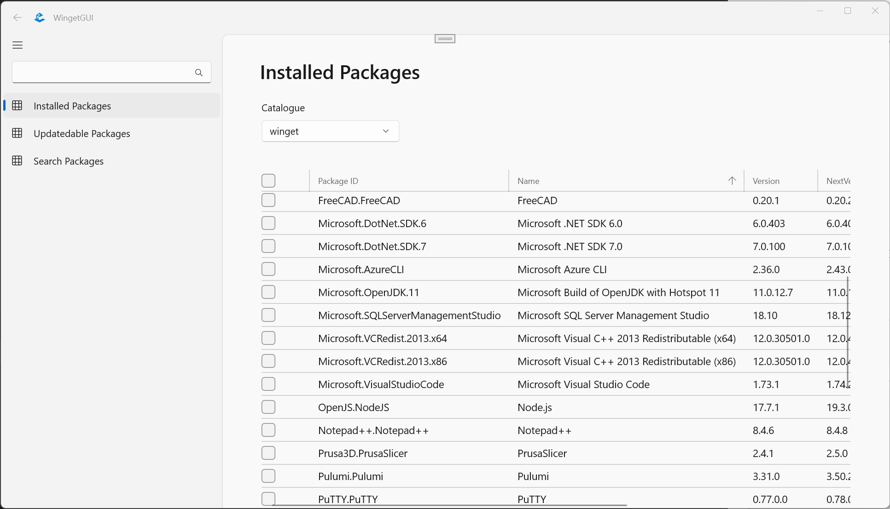

# Winget-ui

This application is a GUI for [winget](https://github.com/microsoft/winget-cli) written in C# on top of WinUI. The app is in alpha/prototype stage but basic functions are there. There is no installer provided at the moment.

DONE:
- Search for available updates
- Install updates
- Search for new packages
- Tested on Windows 11

TODO:
- Install new packages
- Build pipeline
- Add tests
- Installer
- Publish
- Test on Windows 10

## Screenshot

